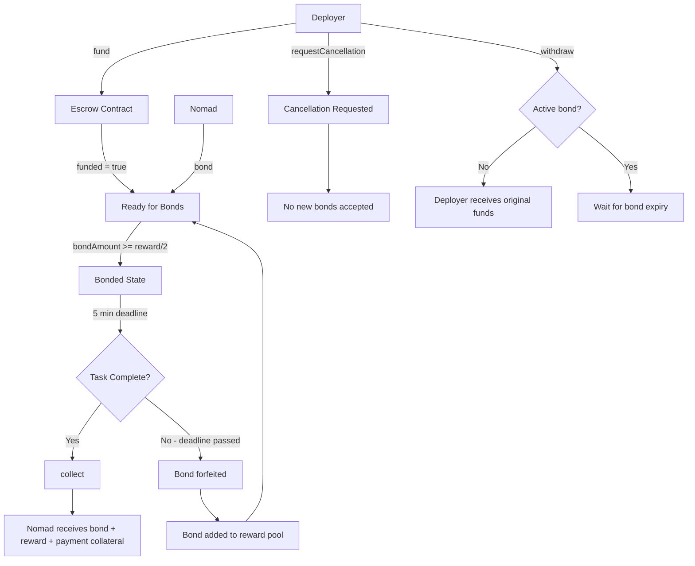

# Mirage Protocol Escrow Contract

This repository contains a Solidity smart contract that provides escrow functionality for the Mirage protocol, enabling secure task execution with bonded guarantees.

**Note**: This is a testing implementation with simplified mechanics. The production contract will differ in implementation details while maintaining the core bonding logic.

## Escrow Contract

The escrow contract facilitates trustless task execution between deployers and [Nomads](https://github.com/MiragePrivacy/Nomad) (Mirage protocol nodes). This single-task escrow operates with ERC20 tokens and manages funds, bonds, and payments through a time-based bonding mechanism:

- **Funding**: Deployers fund the contract with reward and payment amounts for task completion
- **Bonding**: Nomads post bonds (minimum 50% of reward) to secure execution rights within a 5-minute deadline
- **Collection**: Successful Nomads collect their bond plus rewards and payments, fully draining the contract
- **Forfeiture**: Failed Nomads forfeit their bonds, which are added to the reward pool for subsequent attempts
- **Withdrawal**: Deployers can withdraw original funds when no active bonds exist or request cancellation to prevent new bonds

The contract ensures security through immutable deployment parameters, time-based execution deadlines, and bond forfeiture mechanisms that incentivize reliable task completion by Nomads.

## Contract Flow

