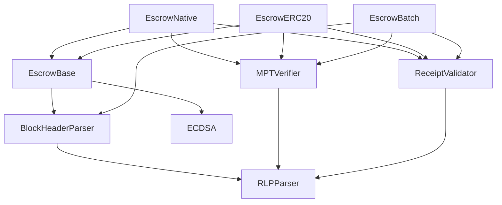

# Mirage Escrow Contracts

This repository contains the open-source Solidity escrow contracts used by Mirage for proof-based, non-custodial payment settlement.

For the full protocol model, product flow, Nomad node documentation, and Azoth documentation, see [docs.mirageprivacy.com](https://docs.mirageprivacy.com).

## High-level model

Mirage separates a private payment into offchain coordination and onchain settlement. A user deploys and funds a temporary escrow for a specific recipient, amount, asset, reward, and execution authorization.

Execution is coordinated through a reservation-style auction system. Nomad nodes inspect encrypted requests offchain and reserve a request for a short time when they are confident they can fulfill it. During that reservation window, the node sends the requested transfer from its own liquidity, then claims reimbursement by submitting an onchain proof.

The escrow does not trust the node's claim. It verifies recent block data, Merkle-Patricia trie inclusion proofs, transaction receipt contents, and expected transfer details before releasing reimbursement and reward funds.

## Contracts

### `EscrowBase.sol`

Shared base for single-transfer escrows. It handles deployer controls, cancellation, blinded-signer authorization, EIP-712 `BondAuth` validation, short-lived reservation locks, and recent block header checks.

### `EscrowNative.sol`

Single native-ETH transfer escrow. It verifies transaction inclusion, receipt inclusion, successful execution, and the transaction `to` / `value` fields before reimbursing the reserved executor.

### `EscrowERC20.sol`

Single ERC-20 transfer escrow. It verifies receipt inclusion and the expected ERC-20 `Transfer(address,address,uint256)` log before reimbursing the reserved executor in the escrow token.

### `EscrowBatch.sol`

Batch escrow for multiple expected transfers. Bidders reserve one or more transfer rows by posting a bond, prove every committed row, and receive reimbursements plus a pro-rata reward share. Expired reservations are released and forfeited bonds are added to the reward pool.

### Proof libraries

- `BlockHeaderParser.sol` reads block numbers and trie roots from Ethereum and Tempo-wrapped headers.
- `MPTVerifier.sol` verifies transaction and receipt trie inclusion.
- `ReceiptValidator.sol` validates receipt status, ERC-20 transfer logs, and native transfer fields.
- `RLPParser.sol` provides low-level RLP helpers.
- `utils/ECDSA.sol` recovers `BondAuth` signers.

## Dependency graph


```mermaid
graph TD
    EscrowNative --> EscrowBase
    EscrowERC20 --> EscrowBase
    EscrowBase --> BlockHeaderParser
    EscrowBase --> ECDSA
    EscrowNative --> MPTVerifier
    EscrowNative --> ReceiptValidator
    EscrowERC20 --> MPTVerifier
    EscrowERC20 --> ReceiptValidator
    EscrowBatch --> BlockHeaderParser
    EscrowBatch --> MPTVerifier
    EscrowBatch --> ReceiptValidator
    BlockHeaderParser --> RLPParser
    MPTVerifier --> RLPParser
    ReceiptValidator --> RLPParser
```

## Azoth pipeline and deterministic variation

This repo is the canonical source for the escrow logic. The normal build pipeline compiles these contracts with Foundry, then `make artifacts` regenerates the pinned bytecode files in `artifacts/` for:

- `EscrowERC20`
- `EscrowNative`
- `EscrowBatch`

CI includes a bytecode guard so source changes that affect compiled output must update the pinned artifacts in the same change.

Azoth sits on top of this canonical bytecode. Deployment tooling can take the open-source escrow bytecode, run it through Azoth with deterministic variation parameters, and produce a contract variant that behaves like the original escrow but has a different bytecode-level shape. The point is not to hide unsafe logic; it is to avoid every Mirage escrow sharing one easy-to-fingerprint bytecode signature.

Because Azoth is deterministic, the verification path is reproducible:

1. Start from the open-source escrow source in this repository.
2. Compile it with the documented build settings.
3. Regenerate or inspect the canonical bytecode artifact.
4. Run Azoth with the same deterministic parameters used for the deployed escrow.
5. Compare the resulting bytecode with the bytecode deployed onchain.

If the bytecode matches, a user, Nomad executor, auditor, or third party can verify that the deployed contract is a valid Mirage escrow variant. This makes verification trustless: both the escrow contracts and Azoth are open source, and neither side needs to rely on a private registry or opaque build service to know what code they are interacting with.

## Development

Run tests:

```sh
forge test
```

Regenerate bytecode artifacts after any contract change that affects compiled output:

```sh
make artifacts
```
